# ClaudeStats Dashboard Guide

A comprehensive guide to understanding the ClaudeStats dashboard and interpreting each metric tile for effective monitoring of your Claude Code token usage.

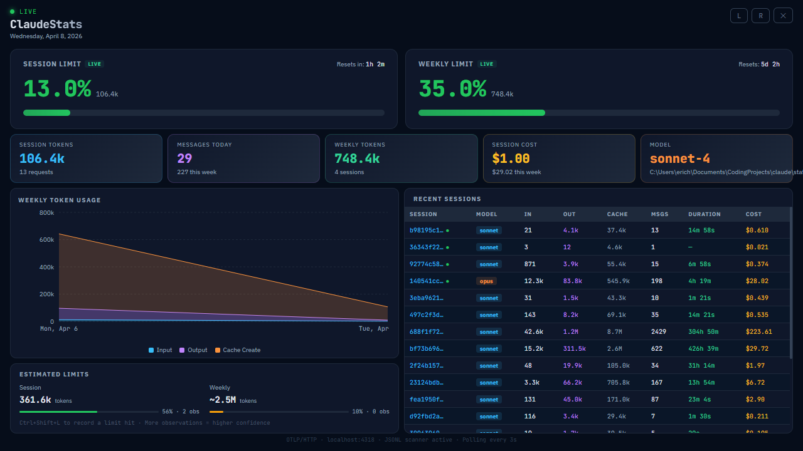

---

## Table of Contents

- [Session Limit](#session-limit)
- [Weekly Limit](#weekly-limit)
- [Session Tokens](#session-tokens)
- [Messages Today](#messages-today)
- [Weekly Tokens](#weekly-tokens)
- [Session Cost](#session-cost)
- [Model](#model)
- [Weekly Token Usage Chart](#weekly-token-usage-chart)
- [Recent Sessions](#recent-sessions)
- [Estimated Limits](#estimated-limits)
- [Session Detail Modal](#session-detail-modal)

---

## Session Limit

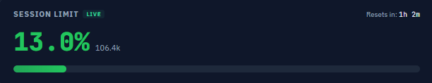

### What It Shows

The **Session Limit** tile displays how much of your 5-hour rolling rate-limit window you have consumed. It is the primary indicator of whether you are approaching a short-term throttle from Anthropic's API.

### How to Read It

| Element | Meaning |
|---------|---------|
| **Percentage** (e.g. `13.0%`) | The fraction of your estimated (or live) session token limit that has been used in the current 5-hour window. |
| **Token count** (e.g. `106.4k`) | The absolute number of tokens consumed within the window. |
| **Progress bar** | A visual gauge that fills from left to right. Green indicates healthy usage; it shifts toward yellow/red as you approach 100%. |
| **"LIVE" badge** | Appears when the dashboard is connected to the Claude.ai API and receiving authoritative utilization data rather than local estimates. |
| **"Resets in" timer** | Countdown until the oldest request in the 5-hour window expires, which will cause the percentage to decrease. |

### How It Works

The session limit tracks a **rolling 5-hour window** of token usage. Every request you make adds to the total; as requests age past the 5-hour mark, they fall off and the percentage drops. When connected to the Claude.ai API, the percentage comes directly from Anthropic's authoritative `five_hour.utilization` field. Otherwise, it is estimated locally based on previously observed rate-limit hits (see [Estimated Limits](#estimated-limits)).

### What to Watch For

- **Approaching 80-100%**: You are at risk of being rate-limited. Consider pausing usage or switching to shorter, more targeted prompts.
- **Stuck at 100%**: You have hit the rate limit. Wait for the "Resets in" timer to count down; as older requests expire, the percentage will drop.
- **Rapid climbs**: Large prompts with extensive context (system prompts, file contents, long conversations) consume tokens quickly. Monitor the rate of increase to pace your work.

---

## Weekly Limit

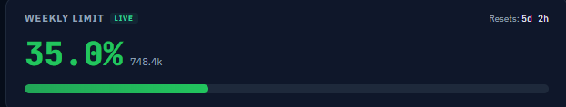

### What It Shows

The **Weekly Limit** tile displays how much of your 7-day rate-limit allocation you have consumed. This is your long-term usage budget.

### How to Read It

| Element | Meaning |
|---------|---------|
| **Percentage** (e.g. `35.0%`) | The fraction of your estimated (or live) weekly token limit consumed since the week started. |
| **Token count** (e.g. `752.4k`) | The absolute number of tokens consumed this week. |
| **Progress bar** | Visual gauge of weekly usage. Grows throughout the week as you work. |
| **"LIVE" badge** | Indicates authoritative data from the Claude.ai API. |
| **"Resets in" timer** | Countdown until the weekly window resets (default: Monday at 6:00 AM). |

### How It Works

The weekly limit window runs from **Monday at 6:00 AM to the following Monday at 6:00 AM** (the reset day and hour are configurable). All token usage within that window accumulates toward the weekly cap. When connected to the Claude.ai API, the utilization comes from Anthropic's `seven_day.utilization` field.

### What to Watch For

- **Mid-week at 50%+**: You are on track to exhaust your weekly budget. Consider rationing usage across the remaining days.
- **Early week at high %**: Heavy usage on Monday/Tuesday leaves less capacity for the rest of the week. Plan your most token-intensive work (large refactors, code generation) strategically.
- **Near 100%**: You may experience degraded service or longer queues until the weekly window resets.

---

## Session Tokens

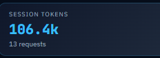

### What It Shows

The **Session Tokens** tile displays the total number of tokens consumed in the current 5-hour rate-limit window, along with the number of API requests made.

### How to Read It

| Element | Meaning |
|---------|---------|
| **Main value** (e.g. `106.4k`) | Total tokens (input + output + cache creation) in the current 5-hour window. |
| **Subtitle** (e.g. `13 requests`) | Number of individual API requests made within the window. |

### Interpretation

This tile gives you the raw numbers behind the [Session Limit](#session-limit) percentage. Comparing the token count to the request count helps you understand your average tokens per request. A high token count with few requests suggests you are sending large context windows; a high request count with modest tokens suggests many small, incremental interactions.

---

## Messages Today

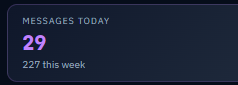

### What It Shows

The **Messages Today** tile tracks how many API requests you have made since midnight, with a subtitle showing the total for the current week.

### How to Read It

| Element | Meaning |
|---------|---------|
| **Main value** (e.g. `29`) | Number of API requests made today (since midnight local time). |
| **Subtitle** (e.g. `215 this week`) | Cumulative request count since the weekly window started. |

### Interpretation

This is a simple activity counter. It helps you gauge how actively you have been using Claude Code throughout the day and week. Unlike token counts, request counts do not directly affect rate limits, but they provide useful context: a day with many messages and low token usage suggests light, conversational interactions, while fewer messages with high token usage indicates heavy-context work sessions.

---

## Weekly Tokens

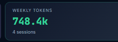

### What It Shows

The **Weekly Tokens** tile shows the total tokens consumed since the weekly window started and how many distinct Claude Code sessions have contributed to that usage.

### How to Read It

| Element | Meaning |
|---------|---------|
| **Main value** (e.g. `752.4k`) | Total tokens used this week across all sessions. |
| **Subtitle** (e.g. `2 sessions`) | Number of distinct Claude Code sessions that have been active this week. |

### Interpretation

This tile provides the raw number behind the [Weekly Limit](#weekly-limit) percentage. The session count in the subtitle helps you understand how your usage is distributed. If a single session accounts for most of the weekly tokens, that session likely involved a large, complex task (e.g., a major refactor or extended debugging session).

---

## Session Cost

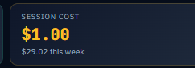

### What It Shows

The **Session Cost** tile displays the estimated USD cost of tokens consumed in the current 5-hour session window, with the weekly cost shown in the subtitle.

### How to Read It

| Element | Meaning |
|---------|---------|
| **Main value** (e.g. `$1.00`) | Estimated cost of tokens used in the current 5-hour window, calculated using Anthropic's published per-token pricing for the model in use. |
| **Subtitle** (e.g. `$28.39 this week`) | Cumulative estimated cost for the current weekly window. |

### Interpretation

Cost is calculated from the per-token rates for input, output, and cache-creation tokens based on the model being used. This is an *estimate* -- actual billing may differ slightly depending on your plan or any negotiated pricing. Use this tile to understand the financial impact of your usage patterns. Opus sessions will show significantly higher costs than Sonnet sessions for the same token volume due to the difference in per-token pricing.

---

## Model

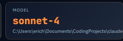

### What It Shows

The **Model** tile displays the Claude model currently in use and the project directory being monitored.

### How to Read It

| Element | Meaning |
|---------|---------|
| **Main value** (e.g. `sonnet-4`) | The Claude model variant active in the current session, with the `claude-` prefix and date suffix stripped for readability (e.g., `claude-sonnet-4-20250514` becomes `sonnet-4`). |
| **Subtitle** | The project directory path being monitored by ClaudeStats. |

### Interpretation

This tile is informational. It confirms which model your session is using, which directly affects both the rate at which you consume your token limits and the cost per token. **Opus** models are more capable but consume limits faster and cost more per token. **Sonnet** models are more cost-efficient. If you see an unexpected model here, it may explain surprising limit consumption rates.

---

## Weekly Token Usage Chart

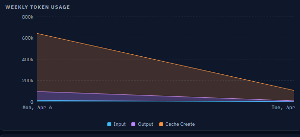

### What It Shows

The **Weekly Token Usage** chart is a stacked area chart that visualizes how your token consumption is distributed across the current week, broken down by token type.

### How to Read It

| Element | Meaning |
|---------|---------|
| **X-axis** | Calendar days from the start of the weekly window (Monday) to the current day. |
| **Y-axis** | Token count (e.g., 200k, 400k, 600k, 800k). |
| **Blue area (Input)** | Tokens sent *to* Claude -- your prompts, system instructions, file contents, and conversation context. |
| **Purple area (Output)** | Tokens generated *by* Claude -- responses, code, explanations. |
| **Orange area (Cache Create)** | Tokens written to Anthropic's prompt cache. These are charged at a higher rate than regular input tokens but save costs on subsequent requests that hit the cache. |

### Interpretation

- **Dominant orange/cache area**: You are sending large, repetitive context blocks (system prompts, project files) that are being cached. This is generally efficient for subsequent requests.
- **Tall spikes on specific days**: Indicates concentrated usage. Correlate with the [Recent Sessions](#recent-sessions) table to identify which sessions drove the spike.
- **Declining trend line**: Your session limit's rolling window is causing older tokens to fall off faster than new ones are added -- usage is naturally decreasing.
- **Input >> Output**: You are sending large prompts (lots of context) relative to what Claude generates. Consider whether all that context is necessary for each request.
- **Output >> Input**: Claude is generating long responses. If this is unexpected, consider more targeted prompts.

---

## Recent Sessions

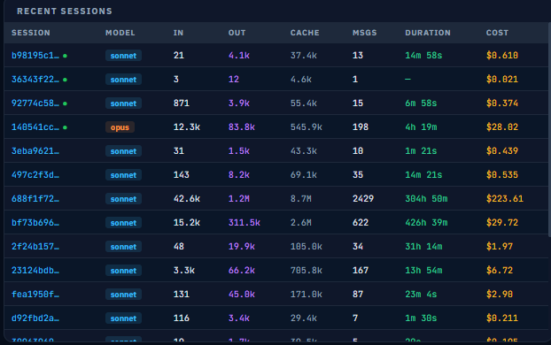

### What It Shows

The **Recent Sessions** table lists your most recent Claude Code sessions (up to 50) with detailed metrics for each.

### How to Read It

| Column | Meaning |
|--------|---------|
| **Session** | A truncated session ID. A green dot indicates the session is currently active. Click to inspect or filter. |
| **Model** | The Claude model used in that session, displayed as a color-coded badge (`sonnet` = blue, `opus` = purple). |
| **In** | Total **input tokens** sent to Claude during the session. |
| **Out** | Total **output tokens** generated by Claude during the session. |
| **Cache** | Total **cache creation tokens** -- the volume of prompt content written to Anthropic's cache during the session. |
| **Msgs** | The number of individual API requests (messages) in the session. |
| **Duration** | Elapsed time from the first request to the last request in the session. |
| **Cost** | Estimated USD cost of the session based on per-token pricing. |

### Interpretation

- **High-cost sessions**: Look for sessions with high cache or output token counts -- these are the primary cost drivers. An Opus session with thousands of messages (e.g., `2429 msgs, $223.61`) indicates an extended, intensive work session.
- **Short duration, high cost**: Indicates dense, context-heavy interactions. You may have been sending large files or long conversation histories.
- **Long duration, low cost**: Light, intermittent usage over an extended period -- typical of background monitoring or occasional queries.
- **Cache >> Input**: The session involved large, repeated context blocks. This is expected when working on projects with substantial system prompts or when Claude Code sends project files as context.
- **Active session indicator** (green dot): Shows which session is currently generating the live metrics in the other tiles.

---

## Estimated Limits

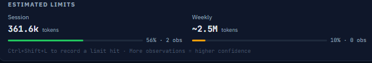

### What It Shows

The **Estimated Limits** tile displays the dashboard's best estimate of your actual token limits for both the session (5-hour) and weekly windows, along with confidence indicators.

### How to Read It

| Element | Meaning |
|---------|---------|
| **Session** (e.g. `361.6k tokens`) | The estimated maximum number of tokens you can use within a single 5-hour window before being rate-limited. |
| **Weekly** (e.g. `~2.5M tokens`) | The estimated maximum number of tokens you can use within a weekly window. A `~` prefix indicates lower confidence in the estimate. |
| **Confidence bar (green)** | The percentage confidence in the session estimate, based on the number and consistency of observed rate-limit hits. |
| **Confidence bar (orange/red)** | The percentage confidence in the weekly estimate. |
| **Observation count** (e.g. `56% - 2 obs`) | The confidence percentage and how many rate-limit hit events have been recorded. More observations yield higher confidence. |
| **Hotkey hint** | `Ctrl+Shift+L` to manually record a limit hit, which improves estimate accuracy. |

### How Estimates Are Calculated

Anthropic does not publicly disclose exact token limits. ClaudeStats estimates them using a statistical approach:

1. Each time you hit a rate limit, the dashboard records the token count at which the limit was triggered as an **observation**.
2. The **10th percentile** of all recorded observations is used as a conservative estimate of the true limit.
3. **Confidence** is calculated from two factors:
   - Number of observations (more data = higher confidence, up to 10 observations for full weight)
   - Consistency of observations (lower variance = higher confidence)

When the Claude.ai API is connected and providing live utilization data, the estimates are replaced with authoritative values and the "LIVE" badge appears on the limit gauges.

### What to Watch For

- **Low confidence / few observations**: The estimate may be significantly off. Use it as a rough guideline, not an exact threshold.
- **`~` prefix on values**: Indicates the dashboard has low confidence in this estimate. The true limit could be substantially higher or lower.
- **Inconsistent observations**: If your limit hits occur at wildly different token counts, the confidence will remain low. This can happen if Anthropic adjusts limits dynamically based on server load.
- **Manual recording**: If you notice you have been rate-limited but the dashboard did not detect it automatically, press `Ctrl+Shift+L` to record the observation manually and improve future estimates.

---

## Session Detail Modal

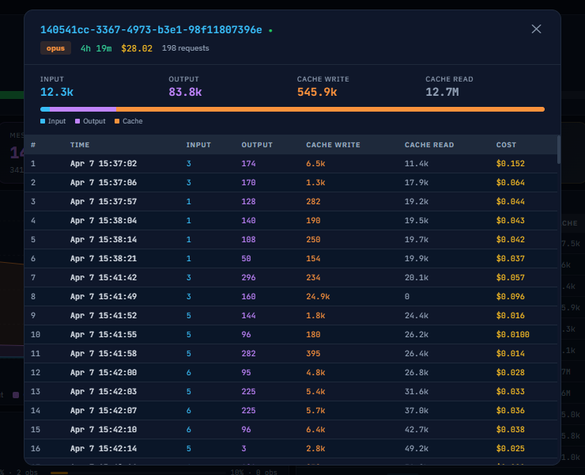

### What It Shows

The **Session Detail Modal** opens when you click any row in the [Recent Sessions](#recent-sessions) table. It provides a complete breakdown of every individual API request made within that session, along with aggregated token statistics and a visual token-type distribution.

### How to Open It

Click any row in the Recent Sessions table. The row will highlight on hover to indicate it is clickable. Click anywhere on the row to open the modal. To close, click the **X** button in the top-right corner of the modal or click anywhere on the dark overlay outside the modal.

### How to Read It

#### Header

| Element | Meaning |
|---------|---------|
| **Session ID** | The full, untruncated session identifier (shown in blue monospace text). |
| **Green dot** | Appears next to the session ID if this session is currently active. |
| **Model badge** | Color-coded badge showing the model variant used (e.g., `opus` in orange, `sonnet` in blue). |
| **Duration** | Total elapsed time from the session's first request to its last request (shown in green). |
| **Cost** | Total estimated USD cost for the entire session (shown in yellow). |
| **Request count** | Number of individual API requests made during the session. |

#### Summary Statistics

| Stat | Meaning |
|------|---------|
| **Input** | Total input tokens sent to Claude across all requests in the session. Displayed in blue. |
| **Output** | Total output tokens generated by Claude across all requests. Displayed in purple. |
| **Cache Write** | Total cache creation tokens -- the volume of prompt content written to Anthropic's prompt cache. Displayed in orange. |
| **Cache Read** | Total cache read tokens -- previously cached content that was reused, avoiding re-transmission. Displayed in muted gray. |

#### Token Distribution Bar

Below the summary statistics, a horizontal bar visualizes the proportion of input (blue), output (purple), and cache write (orange) tokens relative to total usage. This gives an at-a-glance sense of where tokens are being spent in the session.

#### Requests Table

The scrollable table lists every individual API request in the session, ordered chronologically from earliest to latest:

| Column | Meaning |
|--------|---------|
| **#** | Sequential request number within the session (1, 2, 3, ...). |
| **Time** | The date and timestamp of the request (e.g., `Apr 6 14:23:05`). Hover for the full locale-formatted datetime. |
| **Input** | Input tokens for this individual request. |
| **Output** | Output tokens generated by Claude for this request. |
| **Cache Write** | Cache creation tokens for this request. |
| **Cache Read** | Cache read tokens reused from a previous cache for this request. |
| **Cost** | Estimated USD cost of this individual request. |

### Interpretation

- **Large cache write on early requests, declining later**: This is normal. The first few requests in a session typically cache the system prompt and project context. Subsequent requests reuse the cache (high cache read, low cache write).
- **Steadily increasing input tokens**: As a conversation grows, each new request includes more context history, leading to rising input token counts per request.
- **Spikes in output tokens**: Requests where Claude generated large code blocks, long explanations, or extensive refactors will show high output token counts.
- **Many small requests vs. few large ones**: Frequent small requests suggest interactive, conversational usage. Fewer large requests suggest batch-style work (e.g., large code generation or file analysis).
- **Cost concentration**: If a small number of requests account for most of the session cost, those are the ones worth optimizing -- consider whether all the context sent was necessary.

---

## Tips for Managing Your Token Usage

1. **Monitor the session limit** during intensive work sessions. The 5-hour rolling window means that pausing for a couple of hours can free up significant capacity.

2. **Spread weekly usage evenly** when possible. Front-loading heavy usage early in the week leaves less budget for unexpected needs later.

3. **Choose models strategically**. Use Sonnet for routine tasks (code review, small edits, Q&A) and reserve Opus for complex tasks that benefit from stronger reasoning.

4. **Watch your cache creation tokens**. Large cache writes are charged at a premium rate. If your cache column is consistently high, consider whether you can reduce the size of your system prompts or context.

5. **Use the Recent Sessions table** to audit past usage. Sessions with unusually high costs can reveal inefficient patterns worth optimizing.

6. **Record limit hits** with `Ctrl+Shift+L` to improve the accuracy of your estimated limits over time.
